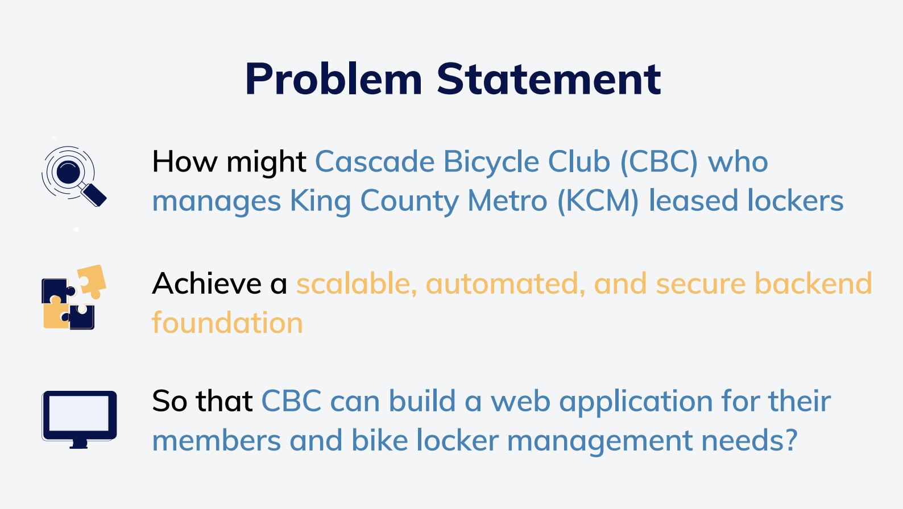
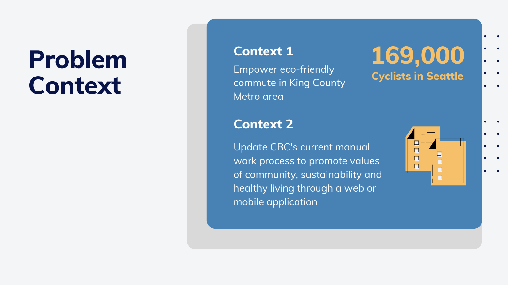
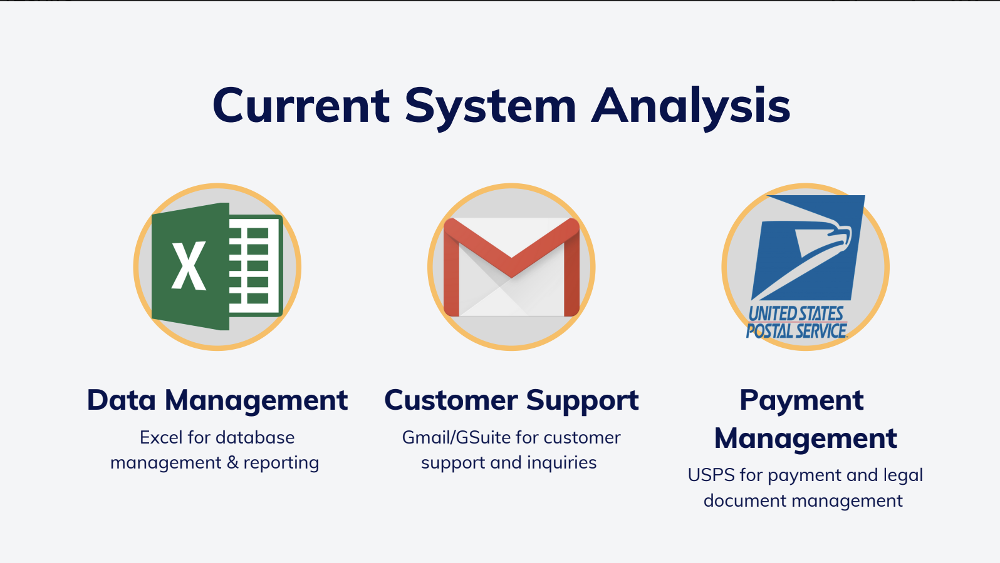
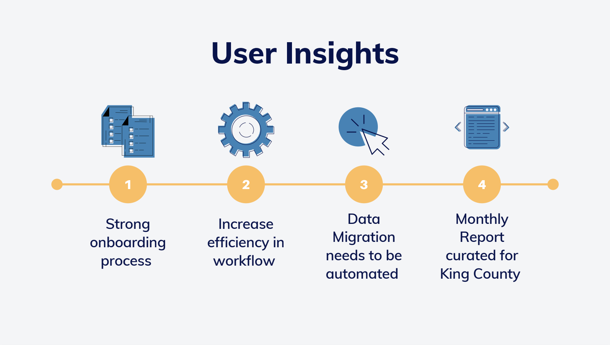
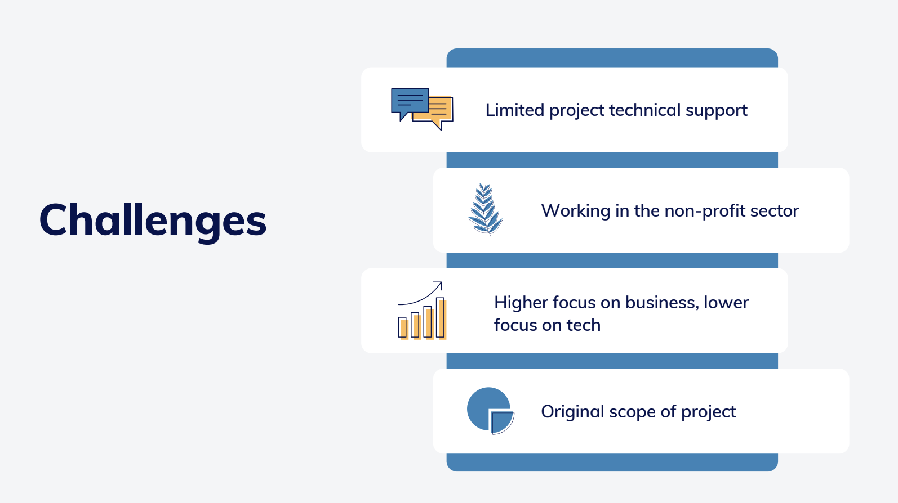
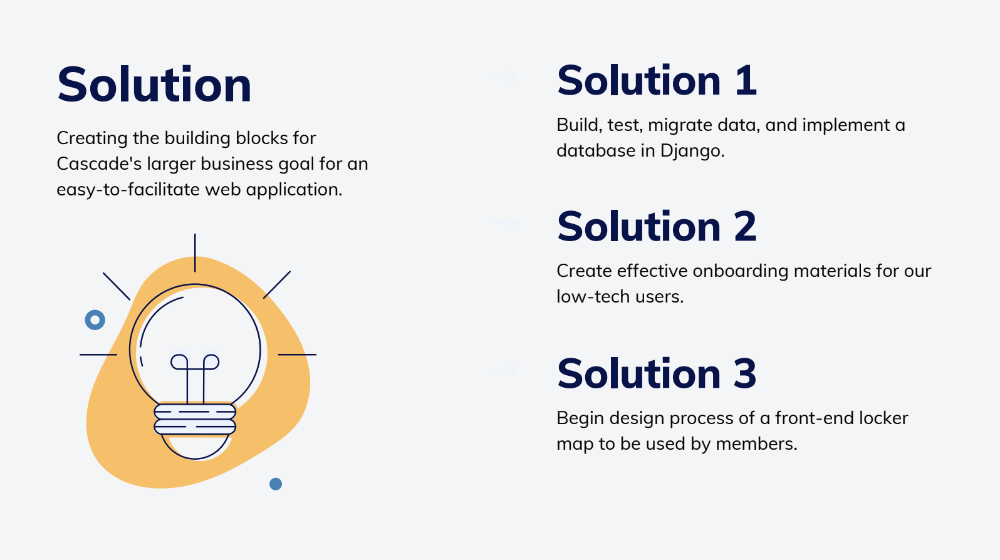

    

## Our Mission
Cascade Bicycle Club handles 220 of King County Metro’s leased bike locker units and manages over 160 customers who rent these eco-friendly and affordable lockers. Cascade relied heavily on manual transactional processes to facilitate their bike locker leasing program. Our project, C-Bike, has successfully eased the process for this non-profit by creating a secure, data-integrable customer management database for locker administrators, and a clear, concise frontend locker rental webpage for customer inquiries. Through C-Bike, customers and administrators can have swift and more secure interactions, thus ensuring that these resources are quickly accessible to those who need them.

## Product
C-Bike involved addressing limitations in Cascade Bicycle Club's existing system by focusing on automating work processes through the development of a robust relational database using Django. The chosen relational schema ensured accurate tracking of various entities in the club's business processes, promoting data integrity and flexibility for efficient querying. Additionally, the project included creating a user-friendly dashboard and a modernized landing page with an interactive map to streamline communication and facilitate easy sign-ups for locker locations, aiming to enhance the user experience and align with CBC's automation goals.

    

    

    

    

    

    

## Problem Space & Solution

    

    

    

    

    

    

## Our Team
- Eva Perez (PM)
    - evagj@uw.edu
- Jeongvin Yeon (PM/UX Design)
    - yeomj@uw.edu
- Alessandro Lou (Full Stack Engineer)
    - alessandro.lou@gmail.com`
- Kathy Tran (Front-end Engineer)
    - ktran@uw.edu
