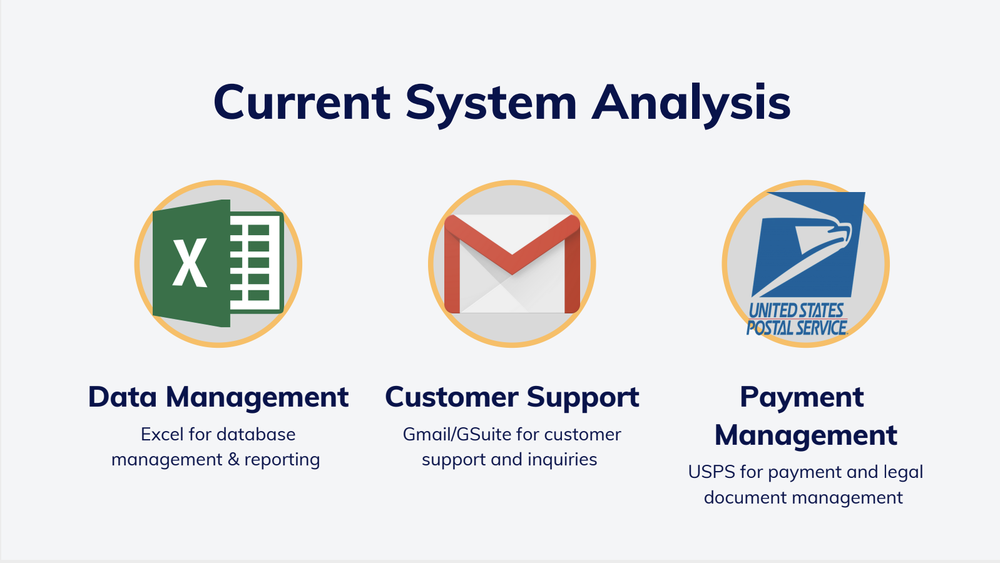

    

## Our Mission
Create the building blocks for Cascade Bicycle  Club's larger business goal for an easy-to-facilitate web application.

## Problem Space & Solution

    

    

    

    

    

    

## Our Team
- Eva Perez (PM)
    - evagj@uw.edu
- Jeongvin Yeon (PM/UX Design)
    - yeomj@uw.edu
- Kathy Tran (Engineer)
    - ktran@uw.edu
- Alessandro Lou (Engineer)
    - alessandro.lou@gmail.com`
